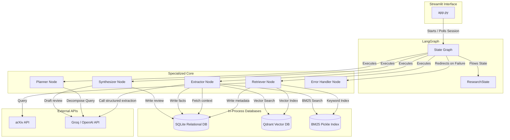
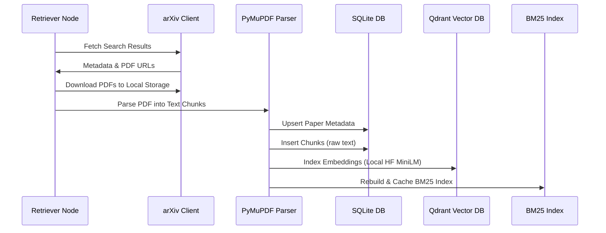
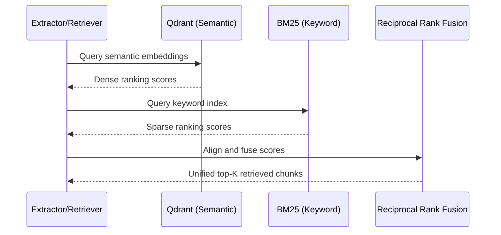

# 🔬 MARIS Architecture Deep Dive

This document outlines the system architecture, component interactions, and engineering decisions of the Multi-Agent Research Intelligence System (MARIS).

---

## 🏗️ System Overview

MARIS is an autonomous literature research agent built on a state-coordinated, multi-agent orchestrator. Rather than relying on simple linear prompt chains, it splits the research lifecycle into modular, specialized nodes that coordinate using a shared State Graph.

---

## 🧩 Core Components

### 1. LangGraph Orchestrator (`src/agents/graph.py` & `src/agents/state.py`)
- **Shared State**: The system centers on `ResearchState`, which tracks sub-queries, retrieved paper chunks, extracted scientific facts, iteration counts, timing waterfalls, and token consumption.
- **Conditional Routing**: Includes self-correcting logic (e.g., `_should_retry_retrieval`). If the Retriever fails to acquire enough matching research papers within a threshold, it automatically increases its search depth and retries, up to `max_iterations`.
- **Fault Tolerance**: The orchestration layer wraps node executions and automatically falls back to an `error_handler` node upon unhandled exceptions.

### 2. Specialized Agent Nodes (`src/agents/nodes.py`)
- **Planner**: Decomposes a general query into 3-5 specific, search-optimized arXiv queries (using logical operators like `AND` and `OR`).
- **Retriever**: Executes queries against arXiv concurrently, downloads paper PDFs, parses them into structured `TextChunk` models, indexes them, and queries the hybrid search index.
- **Extractor**: Uses LLM-driven structured JSON output (`with_structured_output`) conforming to `ScientificExtractionSchema`. It extracts problem statements, methods, datasets, metrics, and structured citations.
- **Synthesizer**: Synthesizes the literature review by combining the raw facts and citations into a cohesive, publication-grade markdown document.

### 3. Storage Layer (`src/storage/`)
- **SQLite (`database.py`)**: Stores relational and structured data (papers, citation edges, sessions, and timing stats). Utilizes **WAL (Write-Ahead Logging)** mode to enable fast concurrent reads and prevents locking under multi-threaded Streamlit requests.
- **Qdrant (`vector_store.py`)**: A local disk-based instance of the Qdrant client. It provides fast semantic embedding search without requiring a running Docker daemon.
- **BM25 Caching**: A sparse keyword search index serialized on disk (`data/bm25_index.pkl`). The system uses an active count validator to automatically rebuild the index only when SQLite paper count deviates from the serialized state.

---

## 🔄 Data Flows

### Ingestion Path

### Retrieval & Hybrid Search Path

---

## ⚡ Key Design Decisions & Trade-Offs

### 1. Local In-Process Storage vs. Dockerized Databases
- **Decision**: SQLite + Qdrant Local Disk Mode.
- **Trade-Off**: Makes deployment trivial (zero external docker dependencies, runs on standard laptops out-of-the-box). However, it limits scale-out capability since multiple server instances cannot easily share the underlying SQLite/Qdrant directories on disk without clustering configurations.

### 2. Reciprocal Rank Fusion (RRF) for Hybrid Search
- **Decision**: Implement a custom RRF algorithm to fuse semantic and keyword search.
- **Trade-Off**: Keyword search (BM25) catches exact matches (e.g. acronyms like "LSTM" or "SSM") which embeddings sometimes miss or dilute. RRF aligns these two disparate score distributions without needing hyperparameter tuning or scale calibration.

### 3. Per-Call SQLite Connections (Connection Pooling)
- **Decision**: Use a context manager (`_connect()`) that spawns a new SQLite connection for every call and closes it immediately.
- **Trade-Off**: Avoids all connection-leak risks under multi-threaded Streamlit web-app contexts. The minor overhead of opening/closing a local SQLite file is negligible compared to network LLM calls.

### 4. Tenacity Exponential Backoff Retry & Provider Fallback
- **Decision**: Configure primary (Groq) and fallback (OpenAI) LLM logic with active retry decorators.
- **Trade-Off**: Mitigates API rate-limiting or outages dynamically. If Groq times out or reaches limits, the system seamlessly retries, and then routes to OpenAI as a fallback to ensure the user's research workspace never crashes.
