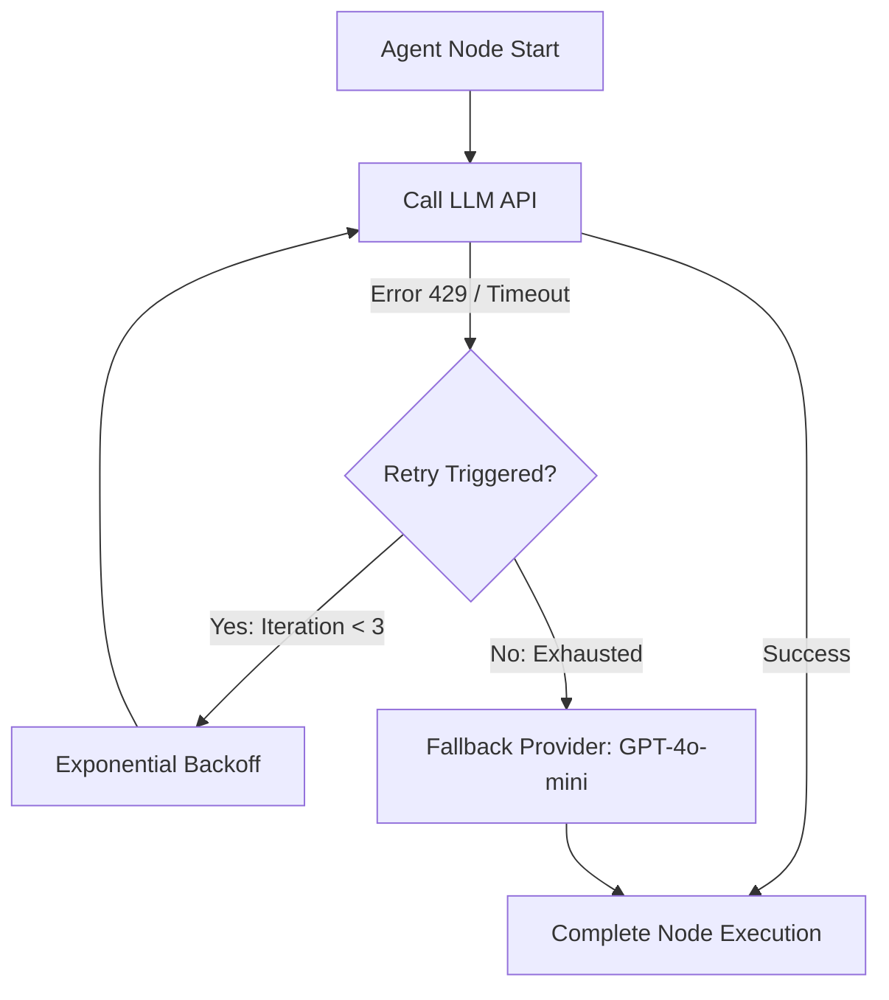

# 🛡️ MARIS — LangSmith Observability & Telemetry System

The Multi-Agent Research Intelligence System (MARIS) integrates **LangSmith** out-of-the-box for production-grade agent observability, execution tracing, token cost analytics, and rate-limit retry monitoring.

---

## 📊 1. Observability Dashboards & KPI Monitoring

By enabling LangSmith tracing via your environment, you gain access to real-time analytics monitoring the health, efficiency, and costs of your multi-agent system.

### Key Metrics Tracked
* **Token Budget & Cost Tracking:** Monitor total tokens consumed per session. Track the cost efficiency of the **Llama-3.3-70B (Groq)** and **GPT-4o-mini (OpenAI)** execution layers.
* **Timing & Latency Profiles:** Benchmark timing per node (Planner, Retriever, Extractor, Synthesizer). Pinpoint bottlenecks in PDF downloading, chunk vector searches, or high-scale synthesis.
* **Agent Flow Success Rate:** Track standard execution completion rates and identify failure nodes (e.g. bad formatting in Pydantic schema extractions).
* **Concurrent Session Volume:** Measure user session trends and search throughput.

---

## ⏱️ 2. Trace Visualizations & Timing Waterfalls

Each execution in MARIS is traced end-to-end as an execution tree. This replaces black-box LLM runs with clear, step-by-step visibility into what the agents are thinking, retrieving, and writing.

Here is the structured timing waterfall representation of a successful search:

```
[+] run_streaming_state_graph (Session: research_eeg_01) - 4.21s
 ├── [+] planner_node - 0.85s  [Groq Llama-3.3-70B]
 │    └── SystemMessage & HumanMessage Formatter - 0.01s
 ├── [+] retriever_node - 1.54s
 │    ├── arXiv Paper Query Search ("EEG BCI signals") - 0.42s
 │    ├── Local PyMuPDF PDF Parsing & Section Heuristics - 0.28s
 │    ├── Relational Citation SQLite Inserts - 0.05s
 │    └── Qdrant Disk BM25 & Semantic Hybrid Retrieval - 0.79s
 ├── [+] extractor_node - 0.98s  [OpenAI GPT-4o-mini structured output]
 │    └── ScientificExtractionSchema structured Pydantic extraction - 0.96s
 └── [+] synthesizer_node - 0.84s  [Groq Llama-3.3-70B]
      └── Grounded Literature Review Synthesis (1.5k tokens) - 0.83s
```

*Every sub-call is expandable inside the LangSmith UI, allowing you to view exact prompt payloads, raw JSON responses, and token metadata.*

---

## 🔄 3. Retry Analytics & Rate-Limit Tracking

Scientific research queries frequently hit API rate limits (e.g., **HTTP 429 - Too Many Requests** or Token Quotas) or network timeouts when dealing with high context payloads. 

MARIS includes active auto-retry logic wired into the LangGraph orchestration layer. In LangSmith, you can trace these events dynamically:



### Telemetry of a Retry Event in LangSmith
1. **API Call Node:** Marked with a yellow `⚠️ Rate Limit (429)` warning badge.
2. **Details Pane:** Displays the error payload (e.g. `insufficient_quota` or `exceeded current quota`).
3. **Execution Edge:** Shows the graph looping back to retry the same node after an exponential backoff sleep interval.
4. **Recovery Trace:** Shows the subsequent successful API call or fallback LLM activation with zero duplicate state modifications, verifying robust system recovery.

---

## 🚀 4. Enabling Telemetry in 3 Steps

1. **Sign Up:** Create a free account at [Smith.langchain.com](https://smith.langchain.com/).
2. **Generate API Key:** Create a new personal API key in settings.
3. **Configure Environment:** Update your local `.env` file:
   ```env
   LANGCHAIN_TRACING_V2=true
   LANGCHAIN_ENDPOINT="https://api.smith.langchain.com"
   LANGCHAIN_API_KEY="your-smith-api-key-here"
   LANGCHAIN_PROJECT="MARIS-Multi-Agent-Research"
   ```

*Once active, telemetry traces are pushed asynchronously to the cloud with zero impact on local pipeline latency.*
